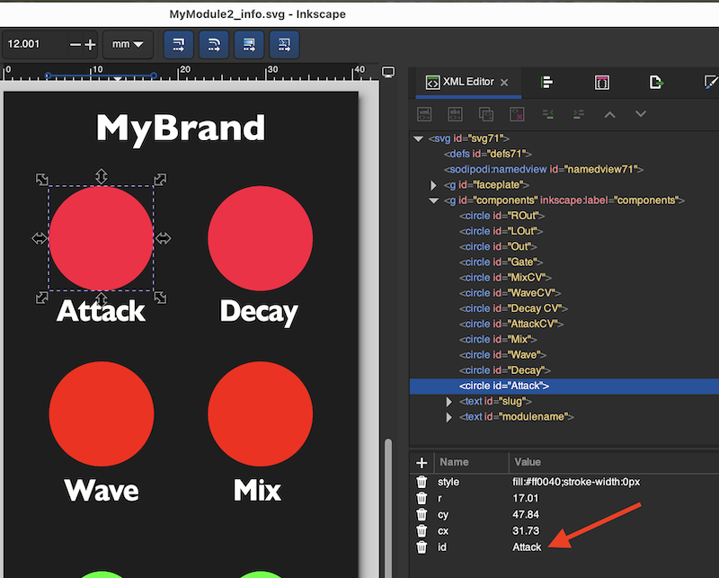
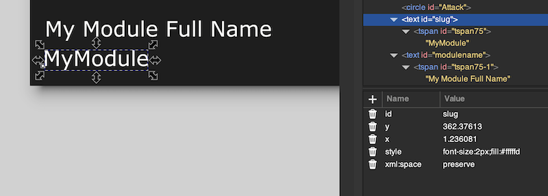

# CoreModule Template

This is a template project for creating a plugin of CoreModules, and 
compiling it as a MetaModule plugin and a VCV Rack plugin.

## Prerequisites
To build, make sure you set RACK_DIR to point to the Rack SDK on your computer.
You will also need all the prerequisites required to build Rack. Read how here:
https://vcvrack.com/manual/PluginDevelopmentTutorial#Prerequisites

The MetaModule SDK is already a submodule of this repo, but you can use a
different MetaModule SDK if you wish (see below).

You also need the following in order to build the MetaModule plugin:
- cmake v3.24 or later
- ninja (not required if you configure cmake to use a different generator)
- arm-none-eabi-gcc toolchain 12.2 or 12.3, installed on your PATH
- python 3.6 or later


Make sure to clone the submodules recursively:

```
git clone https://github.com/4ms/coremodule-template.git
cd coremodule-template
git submodule update --init --recursive
```

## Building

To build just the MetaModule plugin:
```
make mm
```

To build just the Rack plugin:
```
make all
```

To build both plugins:
```
make all mm
```

To package and install the Rack plugin:
```
make install
```

To install the MetaModule plugin, copy the file in `metamodule-plugins/` that
ends in `.mmplugin` to the `metamodule-plugins/` folder on an SD Card or USB
drive. You can do this in your OS, or use the command-line:

```
cp metamodule-plugins/*.mmplugin /Volumes/MyUsbDrive/metamodule-plugins/    # For example
```

To clean the build for both plugins:
```
make clean
```

To re-configure the MetaModule plugin cmake build:
```
make config
```

## Adding or editing a module

Here are all the places you need to create or modify a file in order to add a new module called "NewModule":
Each of these items is explained in more detail below.

- `src/modules/core/NewModule.hh`: create this file
- `src/modules/svg/NewModule_info.svg`: create this file
- `src/modules/info/NewModule_info.hh`: generate this with the svgextract script
- `src/plugin-mm.cc`: Add an `#include "core/NewModule.hh"` and `register_module(...)`
- `src/plugin-vcv.cc`: Add an `#include`, a `GenericModule<...>::create()` and a `p->addModel();`
- `plugin.json`: Add a module entry
- `plugin-mm.json`: Add a module entry
- Create the VCV artwork SVG in `res/`: This SVG file is the same as the info SVG file except with the components layer removed.
- Create the MetaModule artwork PNG in `assets/` (typically using SvgToPng, see Artwork section below).


### Core class: core/NewModule.hh
Each module has two classes: the core class (DSP features) and the info class (GUI features).

In this example, the core class would be in `src/modules/core/NewModule.hh`.

This class is a subclass of `CoreProcessor`. We also have a helper class you can derive from which does some common
tasks for you, called `SmartCoreProcessor`. It's your choice which one you want to have your core class derive from.
Take a look at both examples and see which one is more in line with our coding style:

- `src/modules/core/MyModule.hh` uses CoreProcessor

- `src/modules/core/MyModule2.hh` uses SmartCoreProcessor

Details about using these can be found in the `metamodule-plugin-sdk` README and docs (TODO: link)

### Info class: info/NewModule_info.hh and SVG artwork: svg/NewModule_info.svg

The other class required for every module is an Info class. This class describes all the controls, jacks, lights, displays,
as well as the module slug, faceplate location, and bypass routes.

By convention, info headers are named `Slug_info.hh` where Slug is the module slug.
So, in this example the info class would be in `src/modules/info/NewModule_info.hh`.

While you can write this by hand, getting the XY positions to match the artwork
file is tedious. So, there's a script called `svgextract` that does this
automatically.

1) First, create an SVG file for your modules.

2) Create two "layers" (Illustrator) or "groups" (Inkscape). One is named "components" and the other is named "faceplate".

3) Draw all artwork in the "faceplate" layer/group. If you use fonts, convert them to outlines.

4) In the components layer/group, make circles (and sometimes rectangles) with
   certain colors to indicate the location and type of each kind of element.
   Read the file `SPECS.md` found in `scripts/svgextract` for instructions on how to to do that. (TODO: link)
   Make sure you are not using paths, bezier curves, or polygons. They must be circles.

5. You must have two text objects that are not converted to outlines on the components
   layer.
     - A text object named `slug` with the actual text being the module slug
     - A text object named `modulename` with the actual text being the full, human-friendly name of the module.

If you're using Inkscape, your file should look something like this (XML viewer):


The red arrow in the image above shows an important field: the `id` field will
be used to refer to this element from your code.

Verify your slug and modulename objects are like this:



Also note that the SVG objects are circles, not paths or other shapes.


6. When you have the SVG file, run the svgextract python script on it to create an info file:

```bash
python3 scripts/svgextract/svgextract.py createinfo src/modules/svg/MyModule_info.svg src/modules/info/
```

This will create a file named `MyModule_info.hh` in `src/modules/info`.

7. Open this file and edit the paths to the faceplate files (svg_filename and png_filename).
   The script can't know how you organize these files, so you have to do this manually.
    - svg_filename is the VCV rack panel artwork. This will be something like `"res/panel.svg"`. 
    - png_filename is the MetaModule artwork. This must start with your brand
      slug, that is, the plugin name (`"MyPlugin/panel.svg"`). Keep in mind that
      when the plugin is loaded into MetaModule, it will unpack everything in 
      assets/ into a directory with the name of your brand slug. So if you have
      a file called `assets/panels/ABCD.png` then it will be found at
      `MyBrandSlug/panels/ABCD.png`.


### src/plugin-mm.cc

This file has an `init()` function which is run when the MetaModule firmware loads your plugin.

To add a new module, you need to add two lines:

```c++
#include "CoreModules/register_module.hh"
#include "core/MyModule.hh"
#include "core/MyModule2.hh"
// Add this line when making a new module called NewModule:
#include "core/NewModule.hh"

void init() {
	using namespace MetaModule;

	std::string_view brand = "MyPlugin";

	register_module<MyModule, MyModuleInfo>(brand);
	register_module<MyModule2, MyModule2Info>(brand);

    // Add this line when making a new module called NewModule:
    register_module<NewModule, NewModuleInfo>(brand);
}
```

This assumes your module core class is in `core/NewModule.hh` and that the core
class name is `NewModule`. It also assumes that your info class is named
`NewModuleInfo`. Note that your core class file will include the info class file, so
you don't need to do that in plugin-mm.cc.

The string "MyPlugin" should be changed to match the brand slug.


### src/plugin-vcv.cc

This file has an init funtion that VCV calls when it loads your plugin.
Below is the example file, with three new lines added for a module called `NewModule`.

```c++
#include "plugin-vcv.hh"
#include "vcv/generic_module.hh"

#include "core/MyModule.hh"
#include "core/MyModule2.hh"

// Add this line when making a new module called NewModule:
#include "core/NewModule.hh"

using namespace MetaModule;

rack::Plugin *pluginInstance;

__attribute__((__visibility__("default"))) void init(rack::Plugin *p) {
	pluginInstance = p;

	rack::Model *modelMyModule = GenericModule<MyModuleInfo, MyModule>::create();
	rack::Model *modelMyModule2 = GenericModule<MyModule2Info, MyModule2>::create();

    // Add this line when making a new module called NewModule:
	rack::Model *modelNewModule = GenericModule<NewModuleInfo, NewModule>::create();

	p->addModel(modelMyModule);
	p->addModel(modelMyModule2);

    // Add this line when making a new module called NewModule:
	p->addModel(modelNewModule);
}
```

### plugin.json and plugin-mm.json

You also need to add a module entry in both plugin.json and plugin-mm.json.

Open those files, and it should be obvious where to put a new module. Make sure you 
don't have any json syntax errors, since VCV and MetaModule will both refuse to load the plugin
if they find errors. Consider an online json syntax checker if you don't have one in your IDE.

### VCV SVG artwork

Typically you can just open the Info SVG file (e.g.:
`src/modules/svg/NewModule_info.svg`), delete the components layer, and then save it in the `res/` directory.

Double-check the exact path and spelling of the svg filename. It must exactly match what the svg_filename field
of the info class says. E.g. open up `src/modules/info/NewModule_info.hh` and look for:

```c++
	static constexpr std::string_view svg_filename{"res/NewModule.svg"};
```

Make sure that your panel is actually at `res/NewModule.svg`.


### MetaModule PNG artwork
Once you have the VCV SVG file in res/, typically just run:

```bash
metamodule-plugin-sdk/scripts/SvgToPng.py --input res/ --output assets/
```

Double-check the exact path and spelling of the png filename. It must exactly
match what the `png_filename` field of the info class says. E.g. open up
`src/modules/info/NewModule_info.hh` and look for:

```c++
	static constexpr std::string_view png_filename{"MyPlugin/NewModule.png"};
```

Make sure that your panel is actually at `assets/NewModule.png` and that your brand slug is actually "MyPlugin".
The brand slug appears in plugin-mm.cc and in plugin-mm.json. It must match in all places.

You also need to convert any custom component artwork to PNGs if they happen to live in subdirs.
Just repeat the command above for any subdirs you have in res/ (you need to create the subdir in assets/ as well)


## Using a different MetaModule SDK

To use a different version of the SDK, you have some options.

One way is to checkout a different branch in the SDK submodule:

```bash
cd metamodule-plugin-sdk
git checkout v2.0-dev                 # For example, to checkout the v2.0-dev branch
git submodule update --recursive
cd ..
```

Another option is to use a cmake variable to point to the SDK you want to use on your computer:

```bash
make config METAMODULE_SDK_DIR=/full/path/to/metamodule-plugin-sdk
```

You can also specify where the .mmplugin file goes like this:

```bash
make config METAMODULE_SDK_DIR=/path/SDK-v2/metamodule-plugin-sdk INSTALL_DIR=metamodule-plugins-v2
make mm

make config METAMODULE_SDK_DIR=/path/SDK-v1/metamodule-plugin-sdk INSTALL_DIR=metamodule-plugins-v1
make mm
```

Note that the INSTALL_DIR is relative to the build/ dir, so if you did the
above commands, you'd see the plugins in build/:

```bash
ls -l build

    ...
    drwxr-xr-x   3 user  group       96 Mar 20 11:49 metamodule-plugins-v1/
    drwxr-xr-x   3 user  group       96 Mar 20 11:49 metamodule-plugins-v2/
    ...

ls -l build/metamodule-plugins-v1/

    -rw-r--r--  1 user  group  26624 Mar 20 11:49 MyPlugin.mmplugin

ls -l build/metamodule-plugins-v2/

    -rw-r--r--  1 user  group  26600 Mar 20 11:49 MyPlugin.mmplugin
```


## Using custom knobs, jacks, buttons, etc.

TODO

## FAQ

- _I get an error "<math.h>" not found_
  You are probably using arm gcc 14.2. You must use arm gcc 12.2 or 12.3.


